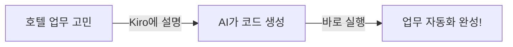

# 워크샵 홈

> **비개발자를 위한 AI 코딩 도구 실습 워크샵**

***

## 👋 환영합니다!

안녕하세요, 롯데호텔 가족 여러분! 🎉

이 워크샵은 **코딩을 전혀 모르는 분들**을 위해 만들어졌습니다.

> "AI가 코딩을 해준다고? 나도 할 수 있을까?"

**네, 할 수 있습니다!** 오늘 이 자리에서 직접 경험해보세요. 🚀

***

## 🎯 워크샵 목표

| 목표          | 설명                   |
| ----------- | -------------------- |
| 🧠 AI 도구 이해 | Kiro IDE가 무엇인지 알기    |
| ✍️ 직접 만들기   | 호텔 업무에 쓸 수 있는 도구 만들기 |
| 💪 자신감 얻기   | "나도 할 수 있다!" 경험하기    |

***

## 📋 오늘의 일정

| 시간     | 내용                                            | 설명            |
| ------ | --------------------------------------------- | ------------- |
| ⏱️ 15분 | [소개 & 환경설정](introduction/)                    | Kiro 설치 및 로그인 |
| ⏱️ 20분 | [Module 1: Steering](module1-steering/)       | AI에게 역할 부여하기  |
| ⏱️ 30분 | [Module 2: Vibe Coding](module2-vibe-coding/) | 대화로 코딩하기      |
| ⏱️ 30분 | [Module 3: Spec 기반 개발](module3-spec/)         | 체계적으로 만들기     |
| ⏱️ 25분 | [Module 4: 자유 실습](module4-challenge/)         | 나만의 도구 만들기    |
| ⏱️ 10분 | [마무리](summary/)                               | 정리 및 Q\&A     |

***

## 🤔 이런 분들을 위한 워크샵입니다

* ✅ 코딩을 한 번도 해본 적 없는 분
* ✅ 엑셀 정도는 쓸 줄 아는 분
* ✅ 반복 업무를 줄이고 싶은 분
* ✅ AI 도구에 관심 있는 분
* ✅ "개발자 없이도 뭔가 만들 수 있을까?" 궁금한 분

***

## 💡 오늘 만들어볼 것들

호텔 업무에서 바로 쓸 수 있는 도구들입니다:

| 도구                | 활용 예시                   |
| ----------------- | ----------------------- |
| 🔍 서비스 매뉴얼 검색 도우미 | "체크인 절차가 어떻게 되지?" 바로 검색 |
| 📧 예약 확인 메일 생성기   | 고객 정보 입력하면 메일 자동 완성     |
| 📋 객실 점검 체크리스트    | 점검 항목 자동 생성             |
| 😤 컴플레인 대응 보고서    | 상황 입력하면 보고서 자동 작성       |
| 👑 VIP 고객 맞춤 안내   | VIP 등급별 맞춤 안내문 생성       |

***

## 🚀 시작할 준비 되셨나요?

👉 [환경 설정부터 시작하기](introduction/getting-started.md)

***

> 💬 **기억하세요**: 오늘 워크샵에서 "못하겠다"는 없습니다. 천천히, 함께 해봐요! 🤝
