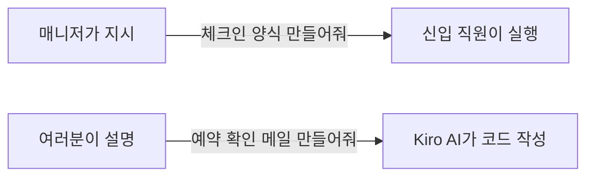

# 시작하기

## 🤖 Kiro IDE란?

**Kiro**는 Amazon에서 만든 AI 코딩 도구입니다.

> 쉽게 말하면: **"말로 설명하면 AI가 코드를 짜주는 도구"** 입니다! ✨

### 호텔로 비유하면...

* 여러분 = **호텔 매니저** 🧑‍💼 (무엇을 만들지 결정하는 사람)
* Kiro AI = **유능한 신입 직원** 🤖 (시키는 대로 빠르게 만드는 사람)

***

## 🎯 오늘 배울 것

| Module   | 내용                   | 호텔 비유                           |
| -------- | -------------------- | ------------------------------- |
| Module 1 | Steering (방향 설정)     | 신입 직원에게 "너는 프론트 데스크 담당이야" 역할 부여 |
| Module 2 | Vibe Coding (대화로 코딩) | "이거 만들어줘" 하고 대화하며 수정            |
| Module 3 | Spec 기반 개발           | 업무 지시서 작성 → 체계적으로 실행            |
| Module 4 | 자유 실습                | 내가 원하는 도구 직접 만들기                |

***

## 💪 걱정하지 마세요!

> ❌ "코딩 못하는데..." ✅ 코딩은 AI가 합니다. 여러분은 **무엇을 만들지** 설명만 하면 됩니다!

> ❌ "컴퓨터 잘 못하는데..." ✅ 카카오톡 칠 수 있으면 충분합니다! 채팅하듯이 AI와 대화하면 됩니다.

> ❌ "실수하면 어쩌지..." ✅ 실수해도 괜찮습니다! 언제든 다시 할 수 있어요. 오늘은 마음껏 실험하는 날입니다! 🧪

***

## 📌 워크샵 규칙

1. **질문은 언제든 환영!** 🙋 손 들고 물어보세요
2. **속도는 상관없어요** 🐢🐇 빠르든 느리든 완주가 목표
3. **옆 사람과 도와주세요** 🤝 함께하면 더 재밌어요
4. **완벽하지 않아도 OK** 👍 작동하면 성공입니다!

***

👉 다음: [환경 설정하기](getting-started.md)
