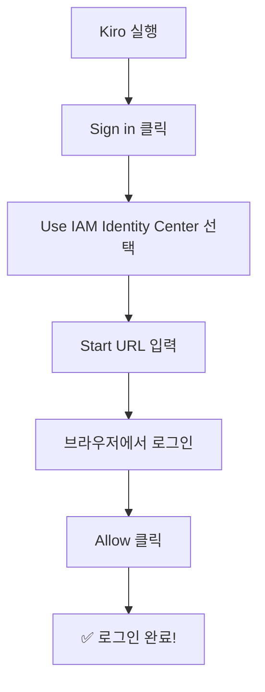

# 환경 설정

## 📋 체크리스트

시작하기 전에 아래 항목을 확인하세요:

* [ ] 노트북 준비 (Windows 또는 Mac)
* [ ] 인터넷 연결 확인
* [ ] Kiro IDE 설치 완료
* [ ] 로그인 완료

***

## Step 1: Kiro IDE 설치 🔧

### Windows

1. [kiro.dev](https://kiro.dev) 접속
2. **Download for Windows** 클릭
3. 다운로드된 파일 실행
4. "다음 > 다음 > 설치" 클릭

### Mac

1. [kiro.dev](https://kiro.dev) 접속
2. **Download for Mac** 클릭
3. 다운로드된 `.dmg` 파일 열기
4. Kiro 아이콘을 Applications 폴더로 드래그

> 💡 **팁**: 설치가 안 되면 손 들어주세요! 진행자가 도와드립니다. 🙋

***

## Step 2: Kiro 로그인 🔑

> ⚠️ **중요**: 로그인은 **AWS IAM Identity Center** 방식을 사용합니다. 워크샵 당일 진행자가 안내하는 URL과 계정 정보를 사용하세요.

1. Kiro IDE 실행
2. **"Sign in"** 버튼 클릭
3. **"Use IAM Identity Center"** 선택
4. 진행자가 안내한 **Start URL** 입력
5. 브라우저가 열리면 제공된 계정으로 로그인
6. "Allow" 클릭하여 Kiro 접근 허용



***

## Step 3: 프로젝트 폴더 만들기 📁

1. 바탕화면에 `kiro-hotel` 폴더 생성
2. Kiro IDE에서 **File > Open Folder** 클릭
3. 방금 만든 `kiro-hotel` 폴더 선택

***

## Step 4: 실습 데이터 준비 📄

Kiro AI 채팅창에 아래 내용을 그대로 입력하세요:

```
아래 URL의 내용을 다운로드해서 data/hotel-manual.md 파일로 저장해줘
https://raw.githubusercontent.com/kshong05311129/kiro-workshop2/main/data/hotel-manual.md
```

> 💡 이 파일은 롯데호텔 서비스 매뉴얼 데이터입니다. 이후 실습에서 검색 대상으로 사용됩니다.

***

## Step 5: 잘 되는지 확인하기 ✅

Kiro IDE 화면에서 아래를 확인하세요:

* [ ] 왼쪽에 파일 탐색기가 보인다
* [ ] 오른쪽에 AI 채팅창이 보인다
* [ ] 상단에 프로젝트 이름이 보인다

> 🎉 **축하합니다!** 환경 설정이 완료되었습니다!

***

## 🔧 트러블슈팅

### "로그인이 안 돼요"

* Start URL을 정확히 입력했는지 확인
* 브라우저 팝업 차단이 되어있지 않은지 확인
* 진행자에게 계정 정보 재확인

### "Kiro가 설치되지 않아요"

* 관리자 권한으로 실행해보세요 (Windows: 우클릭 > 관리자 권한으로 실행)
* 인터넷 연결 확인
* 진행자에게 도움 요청

### "AI 채팅창이 안 보여요"

* 오른쪽 사이드바 아이콘 클릭
* View > AI Chat 메뉴 확인

***

👉 다음: [Module 1: Steering](../module1-steering/)
