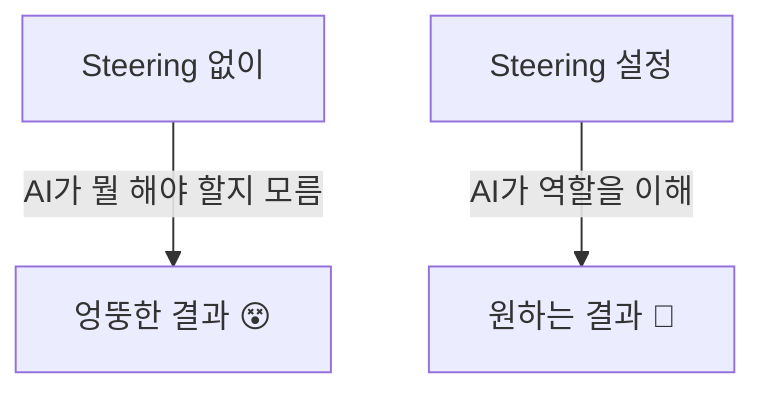

# 🧭 Module 1: Steering (방향 설정)

> ⏱️ 소요시간: 약 20분

---

## 🎯 이번 모듈의 목표

AI에게 **"너는 이런 역할이야"** 라고 알려주는 방법을 배웁니다.

### 호텔로 비유하면...

신입 직원이 첫 출근했을 때, 매니저가 이렇게 말하죠:

> "너는 오늘부터 프론트 데스크 담당이야. 고객 체크인/체크아웃을 도와주고, 항상 밝은 미소로 응대해줘."

이것이 바로 **Steering**입니다! 🎯

AI에게도 똑같이 역할과 규칙을 알려줘야 합니다.

---

## 📋 학습 순서

| 단계 | 내용 | 설명 |
|------|------|------|
| 1️⃣ | [Steering이란?](what-is-steering.md) | 개념 이해하기 |
| 2️⃣ | [Steering 작성하기](write-steering.md) | 직접 만들어보기 |

---

## ✅ 완료 체크리스트

이 모듈을 마치면:
- [ ] Steering이 무엇인지 설명할 수 있다
- [ ] Kiro에서 Steering 파일을 만들 수 있다
- [ ] 호텔 업무에 맞는 Steering을 작성할 수 있다

---

👉 시작: [Steering이란?](what-is-steering.md)
