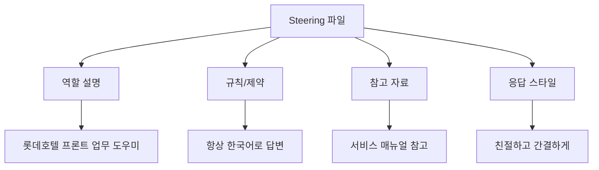

# 🤔 Steering이란?

## 한 줄 요약

> **Steering = AI에게 주는 업무 지침서** 📋

---

## 🏨 호텔 비유로 이해하기

### 신입 직원에게 주는 지침서

신입 직원이 첫 출근하면, 이런 것들을 알려주죠:

| 항목 | 예시 |
|------|------|
| 역할 | "너는 프론트 데스크 담당이야" |
| 말투 | "항상 존댓말, 밝은 톤으로" |
| 규칙 | "VIP 고객은 무조건 매니저에게 보고" |
| 참고자료 | "서비스 매뉴얼 3장 참고해" |

**Steering도 똑같습니다!** AI에게 이런 정보를 미리 알려주는 것이에요.

---

## 📁 Steering 파일이란?

Kiro에서는 `.kiro/steering/` 폴더에 파일을 만들어서 AI에게 지침을 줍니다.

```
내 프로젝트/
└── .kiro/
    └── steering/
        └── hotel-assistant.md    ← 이 파일이 Steering!
```

---

## 💡 Steering이 있으면 vs 없으면

### ❌ Steering 없이 질문했을 때

> 나: "체크인 절차 알려줘"
> AI: (일반적인 호텔 체크인 정보를 대답)

### ✅ Steering 있을 때

> 나: "체크인 절차 알려줘"
> AI: "롯데호텔 서비스 매뉴얼에 따르면, 체크인 절차는 다음과 같습니다..."

**차이가 느껴지시나요?** Steering이 있으면 AI가 **우리 호텔에 맞는** 답변을 해줍니다! 🎯

---

## 🧩 Steering에 들어가는 내용



---

## ✅ 이해도 체크

다음 중 Steering에 해당하는 것은? (정답: 모두!)

- [x] AI에게 "너는 호텔 업무 도우미야" 라고 알려주기
- [x] "답변은 항상 한국어로 해줘" 라고 규칙 정하기
- [x] "서비스 매뉴얼을 참고해서 답변해줘" 라고 자료 알려주기
- [x] "간결하고 친절하게 답변해줘" 라고 스타일 정하기

---

👉 다음: [Steering 작성하기](write-steering.md)
