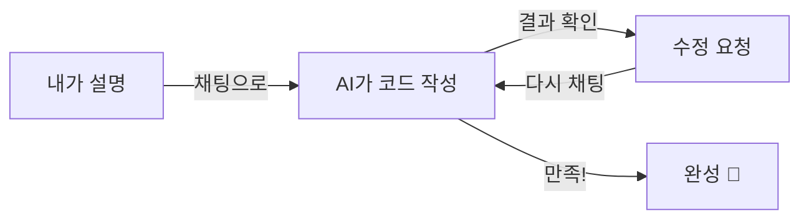

# Module 2: Vibe Coding

> ⏱️ 소요시간: 약 30분

***

## 🎯 이번 모듈의 목표

AI와 **대화하면서** 실제로 작동하는 도구를 만들어봅니다!

### 호텔로 비유하면...

매니저가 신입 직원에게 이렇게 말하는 것과 같아요:

> "예약 확인 메일 양식 좀 만들어줘. 고객 이름이랑 체크인 날짜 넣으면 자동으로 메일이 완성되게."

이렇게 **말로 설명하면** AI가 만들어줍니다! 이것이 **Vibe Coding**이에요. 🎶

***

## 📋 학습 순서

| 단계  | 내용                           | 설명             |
| --- | ---------------------------- | -------------- |
| 1️⃣ | [첫 번째 프롬프트](first-prompt.md) | 처음으로 AI에게 요청하기 |
| 2️⃣ | [반복 개선하기](iterate.md)        | 대화로 수정하기       |
| 3️⃣ | [파일 컨텍스트](file-context.md)   | 참고 자료 활용하기     |

***

## ✅ 완료 체크리스트

이 모듈을 마치면:

* [ ] AI에게 자연어로 요청하여 코드를 생성할 수 있다
* [ ] 결과물을 보고 수정 요청을 할 수 있다
* [ ] 파일을 참고 자료로 활용할 수 있다

***

👉 시작: [첫 번째 프롬프트](first-prompt.md)
