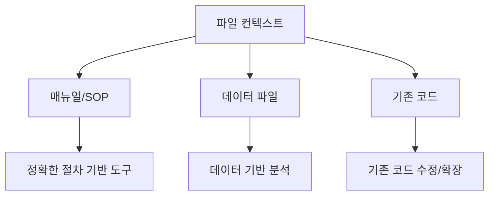

# 파일 컨텍스트

## 🎯 목표

AI에게 \*\*참고 자료(파일)\*\*를 주면서 더 정확한 결과를 만들어봅시다!

***

## 🏨 호텔 비유

> 매니저: "이 서비스 매뉴얼 보고 체크인 안내문 만들어줘" 신입: (매뉴얼을 참고해서 정확한 안내문 작성)

AI에게도 참고 자료를 주면 **훨씬 정확한** 결과를 만들어줍니다!

***

## Step 1: 샘플 데이터 확인 📄

환경 설정에서 이미 `data/hotel-manual.md` 파일을 준비해두었습니다.

왼쪽 파일 탐색기에서 `data` 폴더 안에 `hotel-manual.md` 파일이 있는지 확인하세요!

> 💡 이 파일이 없다면, [환경 설정 - Step 4](../introduction/getting-started.md)를 다시 확인해주세요.

***

## Step 2: 파일을 참고하여 요청하기 📌

이제 이 파일을 **참고 자료로** 활용해봅시다!

채팅 입력창에서 `#` 을 입력하면 컨텍스트 메뉴가 나타납니다. 여기서 파일을 선택할 수 있습니다.

```
#hotel-manual.md 파일을 참고해서,
체크인 절차를 단계별로 안내하는 웹 페이지를 만들어줘.
신입 직원이 보고 따라할 수 있도록 쉽게 만들어줘.
```

> 💡 **핵심**: `#파일명`으로 파일을 참조하면 AI가 그 내용을 읽고 참고합니다!


<figure><figcaption></figcaption></figure>

***

## Step 3: 다른 활용 예시 🌟

### 컴플레인 대응 가이드 만들기

```
#hotel-manual.md 의 컴플레인 대응 섹션을 참고해서,
상황별 대응 스크립트를 보여주는 페이지를 만들어줘.
드롭다운으로 상황을 선택하면 대응 방법이 나오게 해줘.
```

<figure><figcaption></figcaption></figure>

### 객실 업그레이드 판단 도우미

```
#hotel-manual.md 의 업그레이드 정책을 참고해서,
업그레이드 가능 여부를 판단해주는 도구를 만들어줘.
고객 등급과 상황을 선택하면 가능/불가능을 알려주는 형태로.
```

<figure><figcaption></figcaption></figure>

***

## 💡 파일 컨텍스트 활용 팁



| 활용 방법  | 예시                      |
| ------ | ----------------------- |
| 매뉴얼 참고 | "이 매뉴얼 보고 교육 자료 만들어줘"   |
| 데이터 분석 | "이 엑셀 데이터로 차트 만들어줘"     |
| 스타일 참고 | "이 파일 스타일대로 새 페이지 만들어줘" |

***

## ✅ 완료 체크리스트

* [ ] 참고 파일이 프로젝트에 있는 것을 확인했다
* [ ] `#파일명`으로 파일을 참조하여 요청했다
* [ ] 파일 내용이 반영된 결과물을 확인했다

***

## 🔧 트러블슈팅

### "파일을 참조했는데 반영이 안 돼요"

* 파일 경로가 정확한지 확인
* 파일이 프로젝트 폴더 안에 있는지 확인
* `#` 뒤에 정확한 파일명을 입력했는지 확인

### "파일이 너무 길어서 안 되는 것 같아요"

* 필요한 부분만 별도 파일로 분리
* "\~섹션만 참고해줘" 라고 범위 지정

***

> 🎉 **축하합니다!** Module 2를 완료했습니다! 대화로 코딩하는 방법을 마스터했어요!

👉 다음: [Module 3: Spec 기반 개발](../module3-spec/)
