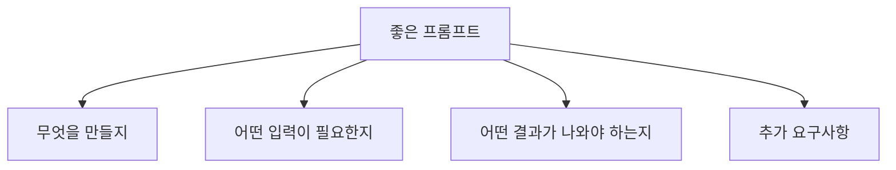

# 🎤 첫 번째 프롬프트

## 🎯 목표

AI에게 처음으로 요청해서 **예약 확인 메일 생성기**를 만들어봅시다!

***

## 🏨 시나리오

> 프론트 데스크에서 매일 수십 건의 예약 확인 메일을 보냅니다. 고객 이름, 체크인 날짜, 객실 타입만 입력하면 자동으로 메일이 완성되면 좋겠죠?

***

## Step 1: AI에게 요청하기 💬

Kiro AI 채팅창에 다음과 같이 입력하세요:

```
예약 확인 메일 생성기를 만들어줘.

- 고객 이름, 체크인 날짜, 체크아웃 날짜, 객실 타입을 입력하면
- 롯데호텔 스타일의 예약 확인 메일이 자동으로 생성되는 HTML 페이지
- 한국어와 영어 버전 모두 생성
- 복사 버튼도 있으면 좋겠어
```

> 💡 **팁**: 구체적으로 설명할수록 좋은 결과가 나옵니다!

***

## Step 2: 결과 확인하기 👀

AI가 코드를 생성하면:

1. 파일이 자동으로 생성됩니다 (예: `reservation-email.html`)
2. 파일 탐색기(Windows) 또는 Finder(Mac)에서 해당 파일을 **더블클릭**하면 브라우저에서 열립니다
3. 입력 폼이 보이는지 확인!

<figure><figcaption></figcaption></figure>

***

## Step 3: 테스트하기 🧪

생성된 페이지에서 다음 정보를 입력해보세요:

| 항목    | 입력값        |
| ----- | ---------- |
| 고객 이름 | 김철수        |
| 체크인   | 2025-03-15 |
| 체크아웃  | 2025-03-17 |
| 객실 타입 | 디럭스 더블     |

메일 내용이 자동으로 생성되나요? 🎉

<figure><figcaption></figcaption></figure>


***

## 💡 좋은 프롬프트 작성 팁



### ❌ 나쁜 예시

```
메일 만들어줘
```

### ✅ 좋은 예시

```
예약 확인 메일 생성기를 만들어줘.
고객 이름, 날짜, 객실 타입을 입력하면
롯데호텔 스타일의 정중한 메일이 생성되는 HTML 페이지.
한국어/영어 버전 모두 필요해.
```

***

## ✅ 완료 체크리스트

* [ ] AI에게 첫 요청을 했다
* [ ] 코드가 생성되었다
* [ ] 브라우저에서 결과를 확인했다
* [ ] 테스트 데이터를 입력해봤다

***

## 🔧 트러블슈팅

### "코드가 생성되지 않아요"

* 채팅창에 메시지를 입력하고 Enter를 눌렀는지 확인
* AI가 응답 중이면 잠시 기다려주세요 (로딩 표시 확인)

### "파일을 어떻게 열어요?"

* 생성된 `.html` 파일을 더블클릭
* 또는 브라우저에 파일을 드래그 앤 드롭

### "결과가 이상해요"

* 괜찮아요! 다음 단계에서 수정하는 방법을 배웁니다 😊

***

👉 다음: [반복 개선하기](iterate.md)
