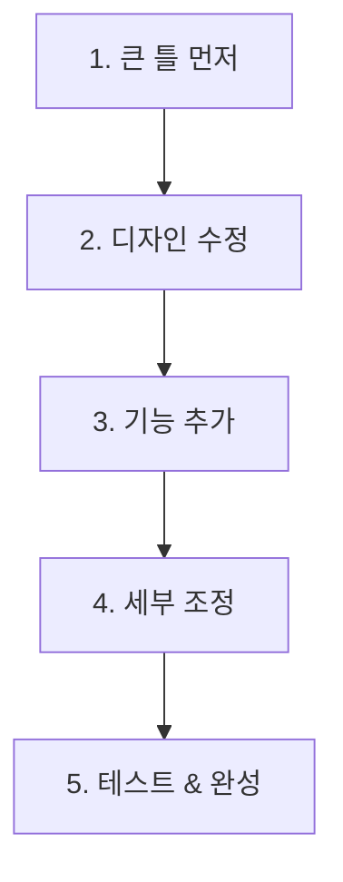

# 반복 개선하기

## 🎯 목표

AI와 **대화를 이어가면서** 결과물을 점점 더 좋게 만들어봅시다!

***

## 🏨 호텔 비유

> 매니저: "이 양식 좀 만들어줘" 신입: (양식 제출) 매니저: "좋은데, 여기에 호텔 로고도 넣어줘" 신입: (수정 후 제출) 매니저: "완벽해! 👍"

AI와의 대화도 이렇게 **주고받으면서** 완성해가는 거예요!

***

## Step 1: 디자인 수정 요청 🎨

이전에 만든 예약 확인 메일 생성기를 더 예쁘게 만들어봅시다:

```
디자인을 더 고급스럽게 바꿔줘.
- 롯데호텔 네이비(#1B2B4B) 색상 사용
- 골드(#C5A572) 포인트 색상
- 폰트는 깔끔하게
- 상단에 "LOTTE HOTEL" 로고 텍스트 추가
```

<figure><figcaption></figcaption></figure>

***

## Step 2: 기능 추가 요청 ⚡

```
추가 기능을 넣어줘:
- 조식 포함 여부 선택 체크박스
- 특별 요청사항 입력란 (예: 고층 선호, 트윈베드 등)
- 생성된 메일을 클립보드에 복사하는 버튼
```

***

## Step 3: 수정 요청 패턴 배우기 📝

### 자주 쓰는 수정 요청 표현들

| 상황    | 표현              |
| ----- | --------------- |
| 추가    | "여기에 \~도 추가해줘"  |
| 삭제    | "\~는 빼줘"        |
| 변경    | "\~를 \~로 바꿔줘"   |
| 스타일   | "더 \~하게 만들어줘"   |
| 오류 수정 | "\~가 안 되는데 고쳐줘" |

### 예시 대화

```
나: "체크아웃 날짜가 체크인보다 이전이면 경고 메시지 보여줘"
AI: (유효성 검사 코드 추가)

나: "경고 메시지를 빨간색으로 보여줘"
AI: (스타일 수정)

나: "완벽해! 고마워 👍"
```

***

## 💡 효과적인 반복 개선 팁



1. **큰 틀을 먼저** 만들고
2. **디자인**을 다듬고
3. **기능**을 추가하고
4. **세부사항**을 조정하세요

> ⚠️ 한 번에 너무 많이 요청하지 마세요! 하나씩 차근차근이 좋습니다.

***

## ✅ 완료 체크리스트

* [ ] 디자인 수정을 요청해봤다
* [ ] 기능 추가를 요청해봤다
* [ ] 3번 이상 대화를 주고받으며 개선했다
* [ ] 최종 결과물에 만족한다

***

## 🔧 트러블슈팅

### "수정이 이상하게 됐어요"

* "이전 버전으로 돌려줘" 라고 요청
* 또는 Ctrl+Z (실행 취소) 사용

### "AI가 제 의도를 못 알아들어요"

* 더 구체적으로 설명해보세요
* 예시를 들어주면 좋아요: "예를 들어, 이런 식으로..."

***

👉 다음: [파일 컨텍스트](file-context.md)
