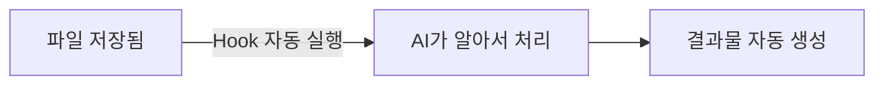
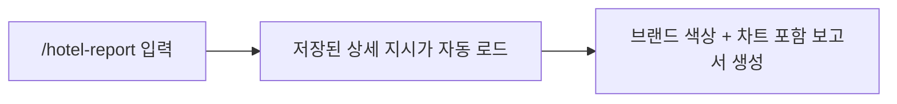

# Module 3: Hook & Skill

> ⏱️ 소요시간: 약 15분

---

## 🎯 이번 모듈의 목표

AI에게 **자동화 규칙**과 **단축 명령어**를 설정해서, 반복 작업을 줄여봅시다!

---

## 🤔 왜 필요할까?

Module 2에서 대화로 코딩하는 법을 배웠죠? 그런데 매번 같은 요청을 반복하면 귀찮습니다.

> 🏨 **호텔 비유**
>
> 매일 아침 프론트 매니저가 "어제 투숙 현황 정리해줘, VIP 리스트 뽑아줘, 매출 요약해줘"라고
> 일일이 지시하면 비효율적이죠?
>
> - **Hook** = "새 투숙객 명단이 들어오면 **자동으로** VIP 체크해놔" (한 번 설정 → 매번 자동)
> - **Skill** = "일일보고서" 한마디면 정해진 양식으로 뚝딱 (복잡한 지시를 한 단어로)

---

## 📌 Hook이란?

**특정 상황이 발생하면 AI가 자동으로 실행되는 규칙**입니다.

한 번 설정하면 매번 시키지 않아도 알아서 동작합니다.



| 예시 | 트리거 | 자동 실행 |
|------|--------|-----------|
| VIP 리스트 자동 생성 | CSV 파일 저장 시 | Premium Suite 고객 목록 추출 |
| 맞춤법 자동 검사 | 문서 저장 시 | 한국어 맞춤법 확인 |
| 보고서 자동 업데이트 | 데이터 변경 시 | 차트 자동 갱신 |

---

## 📌 Skill이란?

**자주 쓰는 복잡한 요청을 미리 저장해둔 단축 명령어**입니다.

매번 긴 프롬프트를 쓰는 대신, `/명령어` 한 번으로 실행할 수 있습니다.



| 비교 | Skill 없이 | Skill 있으면 |
|------|-----------|-------------|
| 매번 입력 | "CSV 데이터 분석해서 객실별 매출, 국적별 비율, 일별 추이를 차트로 만들어줘. 롯데호텔 색상으로..." | `/hotel-report` |
| 결과 | 매번 다를 수 있음 | 항상 일관된 양식 |

---

## 실습 준비: 데이터 다운로드 📄

AI 채팅창에 아래 내용을 입력하세요:

```
아래 URL의 내용을 다운로드해서 data/hotel_operations_april2026.csv 파일로 저장해줘
https://raw.githubusercontent.com/kshong05311129/kiro-workshop2/main/data/hotel_operations_april2026.csv
```

> 💡 이 파일은 2026년 4월 호텔 운영 데이터(예약, 객실, 매출 등)입니다.

---

## 실습 1: Skill 만들기 🎯

### Step 1: Skill 파일 생성

AI 채팅창에 입력하세요:

```
.kiro/skills/hotel-report 폴더를 만들고 SKILL.md 파일을 생성해줘.
내용은 아래와 같아:

---
name: hotel-report
description: 호텔 운영 CSV 데이터를 분석하여 일일 보고서를 생성합니다. 매출 분석, 객실 가동률, 국적별 통계가 필요할 때 사용합니다.
---

## 분석 규칙

1. data 폴더의 CSV 파일을 읽고 분석한다
2. 결과물은 단일 HTML 파일로 생성한다
3. CSV 데이터는 JavaScript 변수로 HTML 안에 직접 임베딩한다 (Python, Node.js 사용 금지)
4. Chart.js CDN을 사용하여 차트를 그린다
5. 롯데호텔 브랜드 색상을 적용한다 (네이비 #1B2B4B, 골드 #C5A572)
6. 한국어로 작성한다
7. 다음 항목을 포함한다:
   - 일별 매출 추이 (라인 차트)
   - 객실 타입별 매출 비중 (도넛 차트)
   - 국적별 예약 비율 (파이 차트)
   - 예약 채널별 분석 (바 차트)
   - 주요 수치 요약 (총 매출, 평균 객단가, 총 예약 건수)
```

### Step 2: Skill 사용해보기

이제 채팅에서 `/`를 입력하면 `hotel-report`가 보입니다. 선택하거나 직접 입력하세요:

```
/hotel-report
```

또는 그냥 자연어로:

```
이번 달 호텔 운영 보고서 만들어줘
```

> 💡 Skill의 description에 "매출 분석", "호텔 운영" 등의 키워드가 있으면, 관련 요청 시 자동으로 활성화됩니다!

### Step 3: 결과 확인

생성된 HTML 파일을 파일 탐색기(Windows) 또는 Finder(Mac)에서 **더블클릭**하면 차트가 포함된 보고서를 확인할 수 있습니다! 📊

---

## 실습 2: Hook 설정하기 ⚡

### Step 1: Hook 만들기

Kiro 왼쪽 패널에서 **Agent Hooks** 섹션을 찾아 **+** 버튼을 클릭합니다.

**"Ask Kiro to create a hook"** 을 선택하고 아래 내용을 입력하세요:

```
CSV 파일이 생성되거나 저장되면, 자동으로 Premium Suite 고객과 특별 요청이 있는 고객 목록을 정리해서 vip-list.html 파일로 만들어줘. 롯데호텔 브랜드 색상으로 예쁘게 만들어줘.
```

### Step 2: Hook 동작 확인

이제 CSV 파일을 저장해보세요. **아무것도 시키지 않았는데** AI가 자동으로 VIP 리스트를 생성합니다!

> 🎉 **이것이 Hook의 힘입니다!** 한 번 설정하면 매번 요청하지 않아도 자동으로 실행됩니다.

---

## 💡 Hook vs Skill 정리

| 구분 | Hook | Skill |
|------|------|-------|
| 실행 방식 | **자동** (이벤트 발생 시) | **수동** (`/명령어` 입력) |
| 설정 | "~하면 ~해줘" | 복잡한 지시를 미리 저장 |
| 호텔 비유 | "체크아웃 시 자동으로 미니바 확인" | "일일보고서" 한마디로 끝 |
| 적합한 상황 | 매번 반복되는 자동화 | 복잡하지만 자주 쓰는 작업 |

---

## ✅ 완료 체크리스트

- [ ] Skill 파일을 생성했다
- [ ] `/hotel-report`로 보고서를 만들어봤다
- [ ] Hook을 설정했다
- [ ] 파일 저장 시 Hook이 자동 실행되는 것을 확인했다

---

## 🔧 트러블슈팅

### "Skill이 `/` 목록에 안 보여요"
- `.kiro/skills/hotel-report/SKILL.md` 경로가 맞는지 확인
- 파일을 저장한 후 잠시 기다려보세요

### "Hook이 자동 실행되지 않아요"
- Agent Hooks 패널에서 Hook이 활성화(enabled) 상태인지 확인
- 파일 패턴(CSV)이 맞는지 확인

### "차트가 안 보여요"
- 인터넷 연결 확인 (Chart.js를 CDN에서 불러옵니다)
- 브라우저에서 HTML 파일을 열었는지 확인

---

> 🎉 **축하합니다!** 이제 AI를 자동화하고 단축 명령으로 활용하는 방법을 배웠습니다!

👉 다음: [Module 4: Spec 기반 개발](../module3-spec/)
