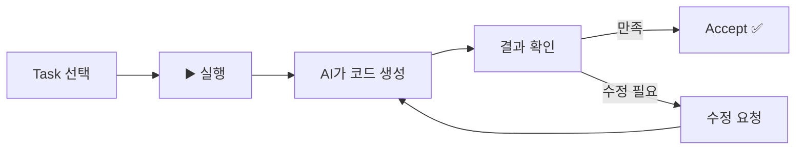

# 🚀 (보너스) Task 실행하기

> ⚠️ **이 페이지는 보너스 콘텐츠입니다.** 시간이 남거나 호기심이 있으신 분만 진행하세요!
> Task 실행은 15~20분 이상 걸릴 수 있습니다.

## 🎯 목표

Spec에서 생성된 **Task를 하나씩 실행**하여 도구를 완성해봅시다!

***

## 🏨 호텔 비유

> 업무 지시서(Spec)를 받은 신입 직원이 항목을 하나씩 체크하며 완료하는 것과 같아요!
>
> * [x] 1단계: 데스크 정리 ✅
> * [x] 2단계: 시스템 로그인 ✅
> * [ ] 3단계: 예약 확인 ← 지금 여기!

***

## Step 1: Task 목록 확인 📋

Spec 패널에서 Task 목록을 확인하세요:

```
- [ ] Task 1: HTML 기본 구조 생성
- [ ] Task 2: 검색 기능 구현
- [ ] Task 3: 카테고리 필터 구현
- [ ] Task 4: UI 스타일링
- [ ] Task 5: 인기 검색어 기능
```

***

## Step 2: Task 실행하기 ▶️

1. 첫 번째 Task 옆의 **▶️ 실행 버튼** 클릭
2. AI가 해당 Task의 코드를 생성합니다
3. 생성된 코드를 확인하고 **Accept** 클릭



***

## Step 3: 순서대로 실행 📊

각 Task를 순서대로 실행해보세요:

### Task 1: 기본 구조 ✅

* HTML 파일 생성
* 기본 레이아웃 완성

### Task 2: 검색 기능 ✅

* 검색 입력 필드
* 매뉴얼 데이터에서 검색

### Task 3: 카테고리 필터 ✅

* 카테고리 버튼 추가
* 필터링 기능

### Task 4: UI 스타일링 ✅

* 롯데호텔 색상 적용
* 카드 디자인

### Task 5: 인기 검색어 ✅

* 자주 찾는 항목 표시

***

## Step 4: 최종 확인 🎉

모든 Task가 완료되면:

1. 생성된 HTML 파일을 브라우저에서 열기
2. 검색어 입력 테스트: "체크인"
3. 카테고리 필터 테스트
4. 모바일 화면 테스트 (브라우저 크기 줄이기)

***

## 💡 Task 실행 팁

| 상황                 | 대처                  |
| ------------------ | ------------------- |
| Task 결과가 마음에 안 들 때 | "이 부분을 \~로 수정해줘" 요청 |
| Task가 에러날 때        | "에러가 나는데 고쳐줘" 요청    |
| 추가 기능이 필요할 때       | Spec에 Task 추가 요청    |

***

## ✅ 완료 체크리스트

* [ ] 모든 Task를 실행했다
* [ ] 각 Task의 결과를 확인했다
* [ ] 최종 결과물이 브라우저에서 작동한다
* [ ] 검색 기능이 정상 동작한다

***

## 🔧 트러블슈팅

### "Task 실행 버튼이 안 보여요"

* Spec이 제대로 저장되었는지 확인
* Spec 패널을 닫았다가 다시 열어보세요

### "Task 실행 중 에러가 나요"

* 에러 메시지를 AI에게 보여주세요: "이 에러 고쳐줘: \[에러 메시지]"
* 이전 Task가 제대로 완료되었는지 확인

### "결과물이 안 예뻐요"

* "디자인을 더 깔끔하게 수정해줘" 요청
* 구체적으로: "버튼을 더 크게, 글자를 더 읽기 쉽게"

***

> 🎉 **축하합니다!** Module 3을 완료했습니다! Spec으로 체계적인 개발을 경험했어요!

👉 다음: [Module 4: 자유 실습](../module4-challenge/)
