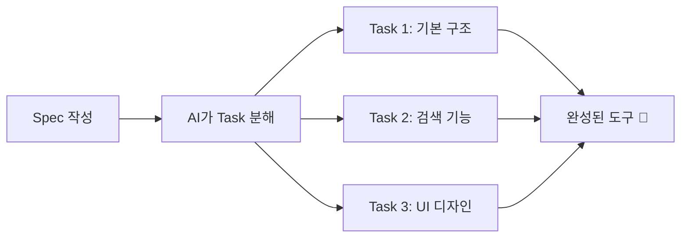

# Spec 작성하기

## 🎯 목표

**호텔 서비스 매뉴얼 검색 도우미**를 Spec으로 설계해봅시다!

***

## 🏨 시나리오

> 롯데호텔 서비스 매뉴얼은 수백 페이지입니다. 신입 직원이 "체크인 절차가 뭐였지?" 할 때마다 매뉴얼을 뒤적이는 건 비효율적이죠. **검색어를 입력하면 관련 내용을 바로 찾아주는 도구**를 만들어봅시다!

***

## Spec이란? 📋

Spec = **"이런 도구를 만들어줘"** 라는 상세 설계서



***

## Step 1: Spec 생성하기

Kiro IDE에서 **Spec 패널**을 열어봅시다:

1. 왼쪽 사이드바에서 **Specs** 아이콘 클릭 (또는 상단 메뉴)
2. **"+ New Spec"** 클릭
3. 다음 내용을 입력:

```
호텔 서비스 매뉴얼 검색 도우미를 만들어줘.

기능:
- 검색어를 입력하면 매뉴얼에서 관련 내용을 찾아서 보여줌
- 카테고리별 필터 (체크인, 체크아웃, 컴플레인, 객실, 부대시설)
- 검색 결과를 카드 형태로 보여줌
- 자주 찾는 항목 TOP 5 표시

디자인:
- 롯데호텔 네이비(#1B2B4B) + 골드(#C5A572) 색상
- 깔끔하고 모던한 디자인
- 모바일에서도 잘 보이게

데이터:
- data/hotel-manual.md 파일의 내용을 검색 대상으로 사용
```

***

## Step 2: AI가 생성한 Spec 확인 👀

AI가 여러분의 요청을 분석해서 **구조화된 Spec**을 만들어줍니다:

예시:

```markdown
## Requirements
- 검색 입력 필드
- 카테고리 필터 버튼
- 검색 결과 카드 UI
- 인기 검색어 표시

## Design
- 색상: 네이비(#1B2B4B), 골드(#C5A572)
- 반응형 레이아웃
- 카드 기반 결과 표시

## Tasks
- [ ] Task 1: HTML 기본 구조 생성
- [ ] Task 2: 검색 기능 구현
- [ ] Task 3: 카테고리 필터 구현
- [ ] Task 4: UI 스타일링
- [ ] Task 5: 인기 검색어 기능
```

***

## Step 3: Spec 수정하기 ✏️

생성된 Spec을 보고 수정하고 싶은 부분이 있으면:

```
Spec에 다음 내용을 추가해줘:
- 검색 결과가 없을 때 "관련 내용을 찾지 못했습니다" 메시지 표시
- 각 결과 카드에 "매뉴얼 원문 보기" 링크 추가
```

***

## 💡 좋은 Spec 작성 팁

| 포함할 것  | 예시                   |
| ------ | -------------------- |
| 기능 목록  | "검색, 필터, 정렬"         |
| 디자인 요구 | "네이비 색상, 모바일 대응"     |
| 데이터 소스 | "hotel-manual.md 참고" |
| 예외 처리  | "결과 없을 때 메시지"        |

***

## ✅ 완료 체크리스트

* [ ] Spec 패널을 열었다
* [ ] 새 Spec을 생성했다
* [ ] AI가 Task를 분해한 것을 확인했다
* [ ] 필요시 Spec을 수정했다

***

👉 다음: [Task 실행하기](run-tasks.md)
