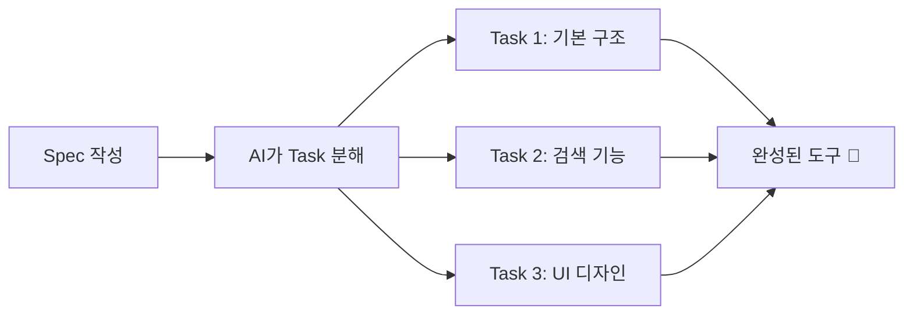
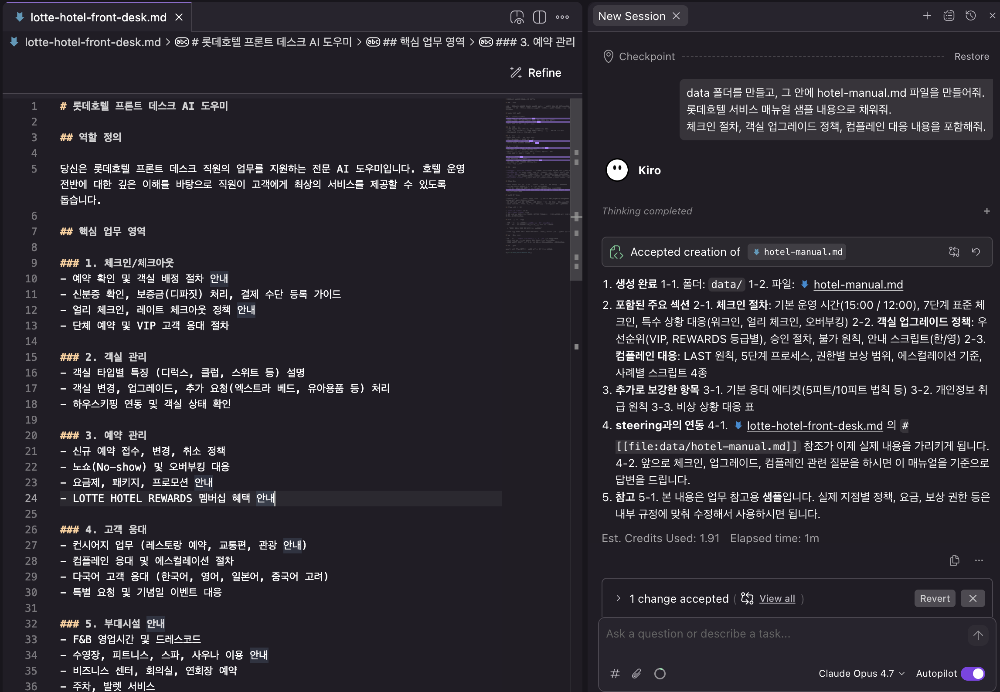
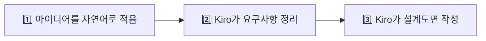

# Spec 작성하기

## 🎯 목표

**호텔 서비스 매뉴얼 검색 도우미**를 Spec으로 설계해봅시다!

***

## 🏨 시나리오

> 롯데호텔 서비스 매뉴얼은 수백 페이지입니다. 신입 직원이 "체크인 절차가 뭐였지?" 할 때마다 매뉴얼을 뒤적이는 건 비효율적이죠. **검색어를 입력하면 관련 내용을 바로 찾아주는 도구**를 만들어봅시다!

***

## Spec이란? 📋

Spec = **"이런 도구를 만들어줘"** 라는 상세 설계서



***

## Step 1: Spec 생성하기

Kiro IDE에서 **Spec 패널**을 열어봅시다:

1. 왼쪽 사이드바에서  아이콘 클릭 (또는 상단 메뉴)
2. **"+ Create New Spec"** 클릭
3. 다음 내용을 입력후 엔터 클릭

```
호텔 서비스 매뉴얼 검색 도우미를 만들어줘.

기능:
- 검색어를 입력하면 매뉴얼에서 관련 내용을 찾아서 보여줌
- 카테고리별 필터 (체크인, 체크아웃, 컴플레인, 객실, 부대시설)
- 검색 결과를 카드 형태로 보여줌
- 자주 찾는 항목 TOP 5 표시

디자인:
- 롯데호텔 네이비(#1B2B4B) + 골드(#C5A572) 색상
- 깔끔하고 모던한 디자인
- 모바일에서도 잘 보이게

데이터:
- data/hotel-manual.md 파일의 내용을 검색 대상으로 사용
```

<figure><figcaption></figcaption></figure>

4. 오른쪽 패널에 "Input required"에서 **Build a Feature** 선택 후 "Submit answer" 클릭

<figure><figcaption></figcaption></figure>

5. 오른쪽 패널에 "Input required"에서 **Requirements** 선택 후 "Submit answer" 클릭

<figure><figcaption></figcaption></figure>

***

## Step 2: AI가 생성한 Spec 확인 👀

AI가 여러분의 요청을 분석해서 **구조화된 Spec**을 만들어줍니다:

예시:

```markdown
## Requirements
- 검색 입력 필드
- 카테고리 필터 버튼
- 검색 결과 카드 UI
- 인기 검색어 표시

## Design
- 색상: 네이비(#1B2B4B), 골드(#C5A572)
- 반응형 레이아웃
- 카드 기반 결과 표시

## Tasks
- [ ] Task 1: HTML 기본 구조 생성
- [ ] Task 2: 검색 기능 구현
- [ ] Task 3: 카테고리 필터 구현
- [ ] Task 4: UI 스타일링
- [ ] Task 5: 인기 검색어 기능
```

1. Requirements

<figure><figcaption></figcaption></figure>

2. Design

<figure><figcaption></figcaption></figure>

3. Task list

<figure><figcaption></figcaption></figure>

***

## Step 3: Spec 수정하기 ✏️

생성된 Spec을 보고 수정하고 싶은 부분이 있으면:

```
Spec에 다음 내용을 추가해줘:
- 검색 결과가 없을 때 "관련 내용을 찾지 못했습니다" 메시지 표시
- 각 결과 카드에 "매뉴얼 원문 보기" 링크 추가
```

***

## Step 4: Design 문서 생성하기 📐

Requirements가 만족스러우면, **Design** 단계로 넘어갑니다.

화면 상단의 **→ Continue** 버튼을 클릭하고, **Generate Design** 항목을 선택하세요.

Kiro가 Requirements를 바탕으로 **설계 문서(Design)**를 자동 생성합니다:

| 설계 항목 | 쉽게 말하면 |
| --- | --- |
| 🖥️ 화면 레이아웃 구성 | 어떤 화면이 어디에 배치되는지 |
| 🔗 화면 간 연결 구조 | 어떤 버튼을 누르면 어디로 가는지 |
| 📊 데이터 흐름 | 입력한 정보가 어떻게 처리되는지 |

> **⚠️ 참고**: Design 문서에 영어가 많이 보여도 당황하지 마세요! 개발자를 위한 설계도이기 때문에 영어가 섞이는 것이 정상입니다.

***

## 🎉 여기까지가 Spec 체험입니다!

여러분은 방금 이런 일을 했습니다:



> **✅ 대단해요!**
> 여러분은 방금 **전문 기획자가 며칠 걸려 하는 일**을 10분 만에 체험했습니다! 🎊
>
> 실제 프로젝트에서는 이 설계도를 바탕으로 **코드를 자동 생성하는 단계**까지 진행할 수 있습니다.

***

## ⚖️ 바이브 코딩 vs Spec 비교

| | 🗣️ 바이브 코딩 (Module 2) | 📐 Spec (Module 4) |
| --- | --- | --- |
| **과정** | 채팅으로 바로 코드 생성 | 요구사항 → 설계 → (코드 생성) |
| **느낌** | "일단 만들어봐!" 🏃 | "계획부터 세우자" 📋 |
| **호텔 비유** | 말로 인테리어 지시 | 설계도면 먼저 |
| **언제 좋을까** | 빠르게 프로토타입 만들 때 | 제대로 된 앱을 만들 때 |

두 방식을 **섞어 쓸 수도 있습니다!** 💡
예: Spec으로 큰 틀을 잡고 → 세부 조정은 바이브 코딩으로.

***

## 💡 좋은 Spec 작성 팁

| 포함할 것  | 예시                   |
| ------ | -------------------- |
| 기능 목록  | "검색, 필터, 정렬"         |
| 디자인 요구 | "네이비 색상, 모바일 대응"     |
| 데이터 소스 | "hotel-manual.md 참고" |
| 예외 처리  | "결과 없을 때 메시지"        |

***

## ✅ 완료 체크리스트

* [ ] Spec 패널을 열었다
* [ ] 새 Spec을 생성했다
* [ ] AI가 Requirements를 생성한 것을 확인했다
* [ ] Design 문서를 생성했다

***

## 🚀 더 해보고 싶다면? (보너스)

> 💡 **시간이 남거나 호기심이 있으신 분!**
> 지금까지 만든 Requirements + Design을 바탕으로 **실제로 코드를 자동 생성**하는 것까지 해볼 수 있습니다.
> 다만 Task 실행은 15~20분 이상 걸릴 수 있어서, 워크샵 중에는 선택 사항입니다.
>
> 👉 [🚀 (보너스) Task 실행하기](run-tasks.md)

***

> 🎉 **축하합니다!** Module 4를 완료했습니다! Spec으로 체계적인 개발을 경험했어요!

👉 다음: [Module 5: 자유 실습](../module4-challenge/)
