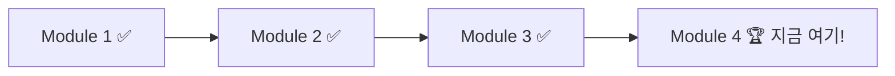

# 🏆 Module 4: 자유 실습

> ⏱️ 소요시간: 약 25분

---

## 🎯 이번 모듈의 목표

지금까지 배운 것을 활용해서 **나만의 호텔 업무 도구**를 만들어봅시다!

---

## 🎉 여기까지 오신 여러분, 대단합니다!

여러분은 이미:
- ✅ AI에게 역할을 부여하는 법 (Steering)
- ✅ 대화로 코딩하는 법 (Vibe Coding)
- ✅ 체계적으로 설계하는 법 (Spec)

을 모두 배웠습니다! 이제 **자유롭게** 만들어보세요! 🚀

---

## 📋 실습 방법

1. 아래 주제 중 **하나를 선택** (또는 자유 주제!)
2. Module 2 방식(Vibe Coding) 또는 Module 3 방식(Spec) 중 편한 방법 선택
3. 25분 동안 자유롭게 만들기
4. 완성되면 옆 사람에게 자랑하기! 🎊

---

## 🎯 추천 주제

| # | 주제 | 난이도 | 설명 |
|---|------|--------|------|
| 1 | 서비스 매뉴얼 검색 도우미 | ⭐⭐ | 매뉴얼 내용을 검색하는 도구 |
| 2 | 고객 컴플레인 대응 보고서 생성기 | ⭐⭐ | 상황 입력 → 보고서 자동 생성 |
| 3 | 예약 확인 메일 생성기 | ⭐ | 고객 정보 → 메일 자동 완성 |
| 4 | 객실 점검 체크리스트 | ⭐ | 점검 항목 체크 & 보고서 |
| 5 | VIP 고객 맞춤 안내 생성기 | ⭐⭐⭐ | VIP 등급별 맞춤 안내문 |

> 💡 난이도가 낮은 것부터 시작하는 것을 추천합니다!

---

👉 [주제별 상세 가이드 보기](topics.md)
