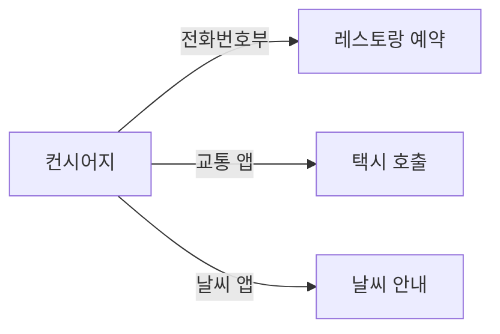
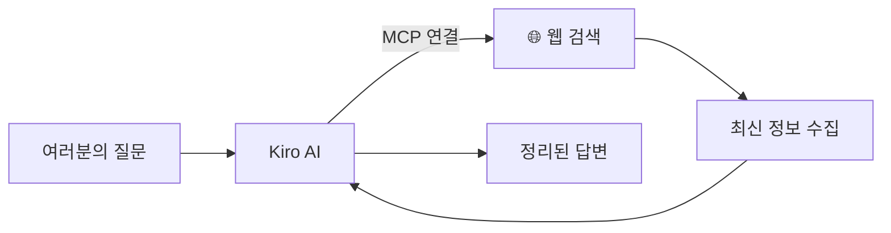

# Module 5: MCP 연동

> ⏱️ 소요시간: 약 20분

---

## 🎯 이번 모듈의 목표

AI에게 **외부 도구를 연결**해서 더 강력하게 만들어봅시다!

---

## 🤔 MCP란?

**MCP (Model Context Protocol)** = AI에게 새로운 능력을 부여하는 방법

### 호텔로 비유하면

> 컨시어지가 아무리 뛰어나도, **전화번호부나 앱이 없으면** 레스토랑 예약도, 택시 호출도 못합니다.

MCP는 AI에게 **전화번호부와 앱을 연결해주는 것**과 같습니다!

---

## 📱 MCP 없는 AI vs MCP 있는 AI

| 상황 | MCP 없음 | MCP 있음 |
|------|----------|----------|
| "최근 호텔 트렌드 알려줘" | 학습된 옛날 정보만 답변 | **실시간 웹 검색**해서 최신 기사 정리 |
| "AWS 문서 찾아줘" | 기억에 의존한 부정확한 답변 | **공식 문서 직접 검색**해서 정확한 답변 |
| "이 파일 분석해줘" | 텍스트만 읽을 수 있음 | **파일 시스템 접근**해서 분석 |

---

## 🔌 오늘 연결할 MCP: 웹서치

오늘은 **웹서치 MCP**를 연결해서 AI가 인터넷 검색을 할 수 있게 만들겠습니다.

**활용 예시:**
- 🏨 호텔 업계 최신 동향 파악
- 📰 경쟁사 뉴스 모니터링
- 🌍 관광 트렌드 리서치

---

## 📋 이번 모듈 순서

| 단계 | 내용 | 설명 |
|------|------|------|
| 1️⃣ | [MCP 설정하기](setup-mcp.md) | 웹서치 MCP 연결 (5분) |
| 2️⃣ | [호텔 동향 리서치](hotel-news.md) | 실습: AI로 업계 동향 정리 (15분) |

---

> 💡 **핵심 포인트**: MCP를 연결하면 AI가 "더 많이 아는 것"이 아니라, "더 많이 할 수 있는 것"이 됩니다!

---

👉 다음: [MCP 설정하기](setup-mcp.md)
