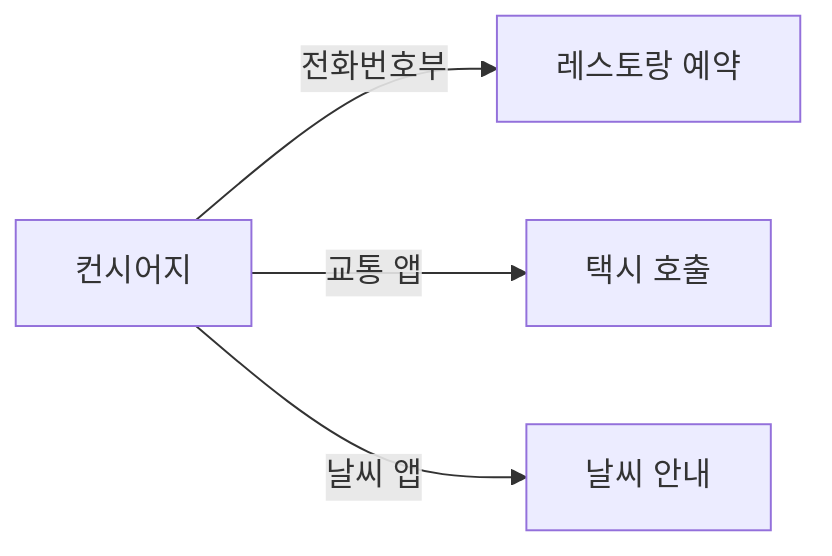
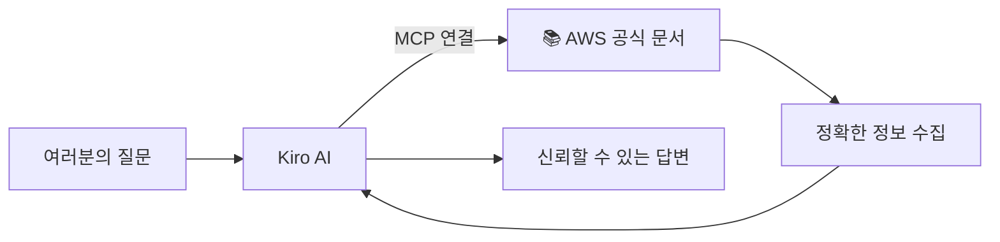

# Module 5: MCP 연동

> ⏱️ 소요시간: 약 20분

---

## 🎯 이번 모듈의 목표

AI에게 **외부 도구를 연결**해서 더 강력하게 만들어봅시다!

---

## 🤔 MCP란?

**MCP (Model Context Protocol)** = AI에게 새로운 능력을 부여하는 방법

### 호텔로 비유하면

> 컨시어지가 아무리 뛰어나도, **전화번호부나 앱이 없으면** 레스토랑 예약도, 택시 호출도 못합니다.

MCP는 AI에게 **전화번호부와 앱을 연결해주는 것**과 같습니다!

---

## 📱 MCP 없는 AI vs MCP 있는 AI

| 상황 | MCP 없음 | MCP 있음 |
|------|----------|----------|
| "AWS Lambda 제한 시간 알려줘" | 학습된 옛날 정보만 답변 | **공식 문서 직접 검색**해서 정확한 답변 |
| "S3 버킷 만드는 법 알려줘" | 기억에 의존한 부정확한 답변 | **공식 문서 기반** 단계별 안내 |
| "프리 티어 서비스 목록 알려줘" | 오래된 정보일 수 있음 | **최신 문서** 기반 정확한 목록 |

---

## 🔌 오늘 연결할 MCP: AWS 문서 검색

오늘은 **AWS 문서 MCP**를 연결해서 AI가 공식 문서를 검색할 수 있게 만들겠습니다.

**활용 예시:**
- 📚 AWS 서비스 정보를 공식 문서 기반으로 정확하게 확인
- 🔍 기술 문서를 AI가 대신 찾아서 요약
- ✅ 학습된 정보가 아닌 실제 문서 기반 답변

---

## 📋 이번 모듈 순서

| 단계 | 내용 | 설명 |
|------|------|------|
| 1️⃣ | [MCP 설정하기](setup-mcp.md) | AWS 문서 MCP 연결 (5분) |
| 2️⃣ | [MCP 활용 실습](hotel-news.md) | MCP 연결 전후 차이 체험 (15분) |

---

> 💡 **핵심 포인트**: MCP를 연결하면 AI가 "더 많이 아는 것"이 아니라, "외부 지식에 직접 접근할 수 있는 것"이 됩니다!

---

👉 다음: [MCP 설정하기](setup-mcp.md)
