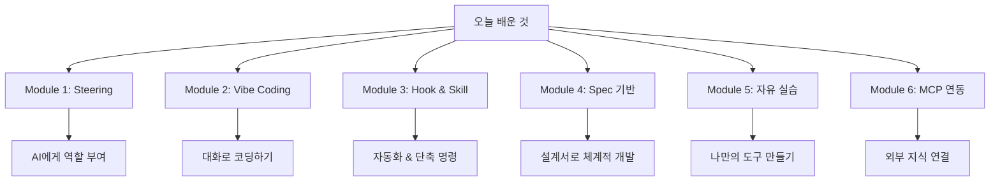

# 마무리

## 🏆 축하합니다!

오늘 워크샵을 완주하신 여러분, 정말 대단합니다! 👏👏👏

***

## 📝 오늘 배운 것 정리

| Module      | 핵심 내용           | 호텔 비유             |
| ----------- | --------------- | ----------------- |
| Steering    | AI에게 역할과 규칙 설정  | 신입 직원에게 업무 지침서 주기 |
| Vibe Coding | 대화로 만들고 수정하기    | 구두 지시로 업무 처리      |
| Hook & Skill | 자동화 규칙 & 단축 명령 | 자동 업무 규칙 & 원클릭 보고서 |
| Spec        | 설계서 작성 → 단계별 실행 | 업무 지시서 → 체계적 실행   |
| 자유 실습       | 배운 것 종합 활용      | 독립적으로 업무 수행       |
| MCP 연동     | AI에 외부 도구 연결    | 컨시어지에게 전화번호부 제공   |

***

## 💡 실무에서 활용하기

### 바로 쓸 수 있는 것들

| 활용 분야  | 예시                 |
| ------ | ------------------ |
| 문서 작성  | 보고서, 안내문, 메일 자동 생성 |
| 정보 검색  | 매뉴얼/SOP 빠른 검색      |
| 데이터 정리 | 엑셀 데이터 분석, 차트 생성   |
| 교육 자료  | 신입 교육 자료, 퀴즈 생성    |
| 체크리스트  | 점검 항목 관리, 보고서 생성   |

### 활용 팁

1. **작은 것부터 시작하세요** - 간단한 메일 템플릿부터!
2. **반복 업무를 찾으세요** - 매일 하는 일 중 자동화할 것
3. **동료와 공유하세요** - 만든 도구를 팀에서 함께 사용
4. **계속 개선하세요** - 사용하면서 조금씩 수정

***

## 🚀 더 배우고 싶다면

| 자료             | 링크                                                                                         |
| -------------- | ------------------------------------------------------------------------------------------ |
| Kiro 공식 문서     | [kiro.dev/docs](https://kiro.dev/docs)                                                     |
| Kiro FAQ       | [kiro.dev/faq](https://kiro.dev/faq/)                                                      |
| Kiro GitHub    | [github.com/kirodotdev/Kiro](https://github.com/kirodotdev/Kiro)                           |

***

## 📊 워크샵 피드백

오늘 워크샵은 어떠셨나요? 솔직한 피드백을 부탁드립니다! 🙏

* 가장 재미있었던 부분은?
* 어려웠던 부분은?
* 실무에서 활용하고 싶은 것은?
* 개선할 점은?

***

## 🙏 감사합니다!

오늘 함께해주셔서 감사합니다!

> 💬 "코딩을 몰라도 AI와 함께라면 무엇이든 만들 수 있습니다."

여러분의 호텔 업무가 조금이라도 편해지길 바랍니다! 🏨✨

***

**워크샵 진행**: Kiro Workshop Team **문의**: 워크샵 진행자에게 연락해주세요
